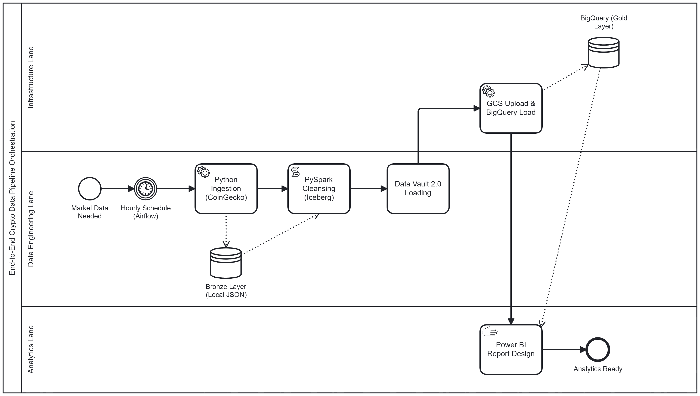
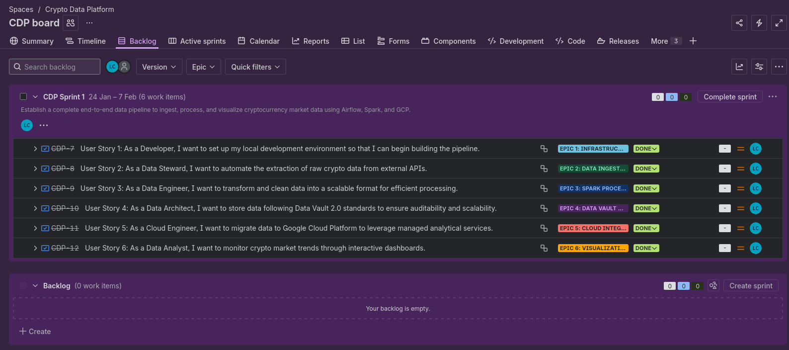
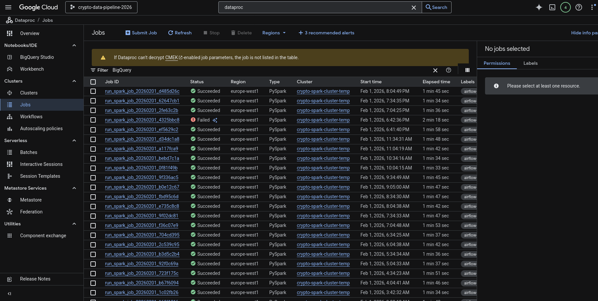
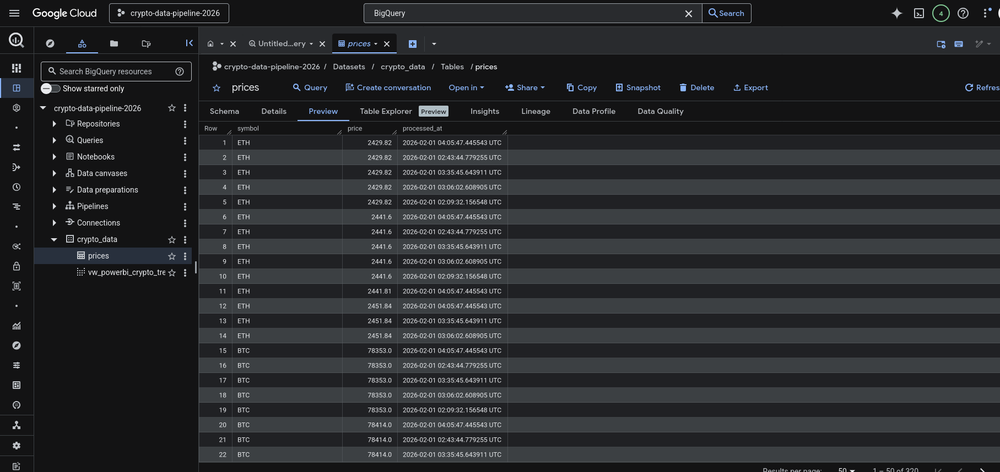

# Crypto Cloud Data Engineering Pipeline

## 📖 Project Overview
This repository contains a production-grade data engineering pipeline that ingests real-time cryptocurrency data and processes it using a hybrid cloud architecture. The project demonstrates advanced orchestration techniques in **Apache Airflow**, leveraging **Google Cloud Platform (GCP)** for scalable processing.

Following **Clean Code** principles, all core processing logic is decoupled into a dedicated `src/` directory, while the `dags/` folder contains only lightweight orchestration scripts. [cite: 2026-02-01]

---

## 🏗️ Architecture & Design
The system follows a multi-layer data architecture (Medallion Architecture) and is modeled using **Data Vault 2.0** standards.

### 🗺️ High-Level Process (BPMN 2.0)

*Figure 1: High-level ETL process designed in Camunda Modeler.*

### 🛠️ Technology Stack
* **Orchestration:** Apache Airflow (Dockerized)
* **Compute:** PySpark, Google Cloud Dataproc
* **Storage:** Local SSD (Bronze/Silver), Google Cloud Storage, BigQuery (Gold)
* **Table Format:** Apache Iceberg
* **Modeling:** Data Vault 2.0 (Hubs & Satellites)

---

## 🚀 Development Roadmap (Jira Epics)
The project was managed using Agile methodology, broken down into 6 key Epics.


*Figure 2: Final state of CDP Sprint 1, showing all User Stories completed.*

### 1. Infrastructure Setup
* Deployed a containerized Airflow environment on Ubuntu.
* Mapped local volumes for persistent storage and the `src/` module library. [cite: 2026-02-01]

### 2. Ingestion & Bronze Layer
* Automated hourly extraction from CoinGecko API.
* Persisted raw JSON data to local Bronze storage.

### 3. Spark Processing & Silver Layer
* Implemented schema validation and deduplication using PySpark.
* Utilized **Apache Iceberg** for efficient data management and time travel capabilities.

### 4. Data Vault Modeling
* Architected a scalable schema with Hubs and Satellites to ensure auditability.
* Developed modular Spark loaders to populate the Vault structure.

### 5. Cloud Integration (GCP)

*Figure 3: Airflow DAG orchestrating ephemeral Dataproc clusters.*

* **Ephemeral Compute:** The pipeline dynamically creates a Dataproc cluster, submits the Spark job, and deletes the cluster upon completion to optimize costs.

* **Reliability & Fault Tolerance:** The system is designed to handle temporary cloud glitches. As shown in the job history, the pipeline automatically manages retries to ensure data consistency.

* **Data Warehouse:**  Final optimized datasets are loaded into **BigQuery** for downstream analytics, following the Data Vault 2.0 structure.

#### Cloud Execution Proof:

| Dataproc Job History | BigQuery Gold Layer |
| :--- | :--- |
|  |  |
| *Successful PySpark executions* | *Final processed crypto data* |

### 📊 6. Data Visualization (Power BI)
The final layer of the platform is an interactive Power BI dashboard that provides real-time insights into the processed cryptocurrency market data.


*Figure 4: Interactive dashboard displaying market trends, price volatility, and historical analysis.*

**Key Features:**
* **Real-time Price Tracking:** Connected directly to the BigQuery Gold layer for up-to-date market prices.
* **Trend Analysis:** Visualizing price movements and volume changes over time using Spark-processed historical data.
* **Data Vault Integrity:** The dashboard reflects the auditability and consistency of the underlying Data Vault 2.0 architecture.
---

## 📂 Project Structure
A key feature of this project is the **Separation of Concerns**. [cite: 2026-02-01]

```bash
.
├── airflow/                # Airflow Environment
│   ├── dags/               # DAG definitions (Orchestration only)
│   └── logs/               # Execution logs
├── src/                    # Core Business Logic (PySpark & Python)
│   ├── coingecko_ingestion.py
│   ├── vault_loader.py
│   └── crypto_spark_pipeline.py
├── data/                   # Local Bronze/Silver storage
├── docs/images/            # Architecture diagrams and screenshots
├── docker-compose.yaml     # Infrastructure as Code
├── Dockerfile              # Custom Airflow image with Spark/GCP dependencies
├── gcp-key.json            # Google Cloud Service Account key (Local only)
└── README.md


🔒 Security Note: The gcp-key.json file shown in the structure is used for local authentication to Google Cloud services. This file is excluded from version control via .gitignore for security reasons. Users should provide their own Service Account key to run the pipeline.